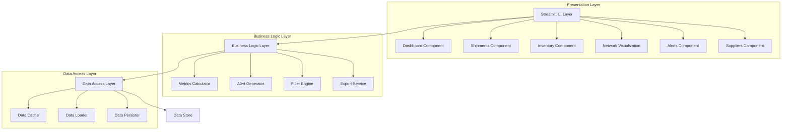
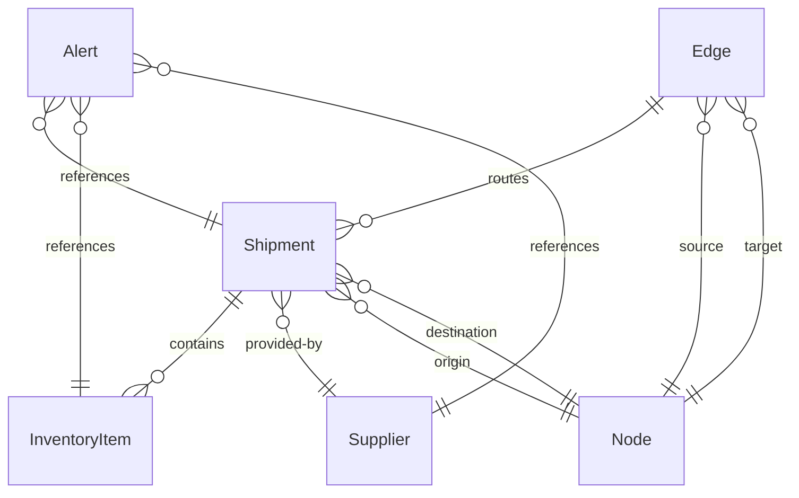

# Design Document: Supply Chain Visibility

## Overview

The Supply Chain Visibility application is a Streamlit-based web application that provides real-time monitoring and analysis of supply chain operations. The application enables supply chain managers, logistics coordinators, inventory managers, and analysts to track shipments, monitor inventory levels, assess supplier performance, and respond to disruptions.

The design follows a layered architecture with clear separation between data access, business logic, and presentation layers. The application leverages Streamlit's reactive programming model for automatic UI updates and uses Python's data science ecosystem (pandas, plotly) for data manipulation and visualization.

Key design principles:
- Reactive UI updates driven by data changes
- Modular component structure for maintainability
- Efficient data caching to minimize recomputation
- Extensible data source abstraction for multiple backends
- Property-based testing for correctness validation

## Architecture

### High-Level Architecture



### Component Responsibilities

**Presentation Layer (Streamlit UI)**
- Renders interactive visualizations and controls
- Handles user input and interactions
- Manages session state and filter persistence
- Delegates business logic to service layer

**Business Logic Layer**
- Calculates derived metrics (on-time delivery rate, performance scores)
- Generates alerts based on business rules
- Applies filters and search criteria
- Formats data for export

**Data Access Layer**
- Abstracts data source details (CSV, database, API)
- Implements caching strategy for performance
- Handles data loading and persistence
- Manages data refresh intervals

### Data Flow

1. **Application Startup**: Load data from Data_Store into cache
2. **User Interaction**: User applies filters or searches → Filter Engine processes → UI updates
3. **Periodic Refresh**: Timer triggers → Data Loader fetches updates → Cache refreshes → UI re-renders
4. **Status Update**: External update received → Data Persister saves → Cache invalidates → UI updates
5. **Export Request**: User requests export → Export Service formats data → File generated

## Components and Interfaces

### Core Components

#### 1. Dashboard Component
```python
class Dashboard:
    """Main dashboard displaying supply chain metrics"""
    
    def render(self, data: SupplyChainData, filters: FilterCriteria) -> None:
        """Render dashboard with current metrics"""
        
    def get_metrics(self, data: SupplyChainData) -> DashboardMetrics:
        """Calculate dashboard metrics from data"""
```

#### 2. Shipment Tracker
```python
class ShipmentTracker:
    """Tracks and displays shipment information"""
    
    def list_shipments(self, filters: FilterCriteria) -> List[Shipment]:
        """Get filtered list of shipments"""
        
    def get_shipment_details(self, shipment_id: str) -> ShipmentDetails:
        """Get detailed information for a specific shipment"""
        
    def search_shipments(self, query: str, field: str) -> List[Shipment]:
        """Search shipments by identifier, origin, or destination"""
```

#### 3. Inventory Monitor
```python
class InventoryMonitor:
    """Monitors inventory levels across locations"""
    
    def get_inventory_levels(self, filters: FilterCriteria) -> List[InventoryItem]:
        """Get current inventory levels with filters applied"""
        
    def get_low_stock_items(self, threshold: float) -> List[InventoryItem]:
        """Identify items below stock threshold"""
        
    def get_inventory_trends(self, item_id: str, days: int) -> TimeSeries:
        """Get historical inventory data for trend analysis"""
```

#### 4. Network Visualizer
```python
class NetworkVisualizer:
    """Visualizes supply chain network topology"""
    
    def render_network(self, nodes: List[Node], edges: List[Edge]) -> Figure:
        """Render network diagram with nodes and connections"""
        
    def get_node_details(self, node_id: str) -> NodeDetails:
        """Get details for a specific network node"""
        
    def render_geographic_map(self, nodes: List[Node]) -> Figure:
        """Render nodes on interactive geographic map"""
```

#### 5. Alert Generator
```python
class AlertGenerator:
    """Generates and manages supply chain alerts"""
    
    def generate_alerts(self, data: SupplyChainData, rules: AlertRules) -> List[Alert]:
        """Generate alerts based on business rules"""
        
    def check_shipment_delays(self, shipments: List[Shipment]) -> List[Alert]:
        """Check for delayed shipments"""
        
    def check_inventory_levels(self, inventory: List[InventoryItem]) -> List[Alert]:
        """Check for critical low stock"""
        
    def check_supplier_performance(self, suppliers: List[Supplier]) -> List[Alert]:
        """Check for underperforming suppliers"""
        
    def acknowledge_alert(self, alert_id: str) -> None:
        """Mark alert as acknowledged"""
```

#### 6. Supplier Performance Tracker
```python
class SupplierPerformanceTracker:
    """Tracks and analyzes supplier performance"""
    
    def get_supplier_metrics(self, supplier_id: str) -> SupplierMetrics:
        """Get performance metrics for a supplier"""
        
    def calculate_on_time_rate(self, supplier_id: str) -> float:
        """Calculate on-time delivery rate"""
        
    def rank_suppliers(self, criteria: RankingCriteria) -> List[SupplierRanking]:
        """Rank suppliers by performance criteria"""
        
    def get_performance_history(self, supplier_id: str, days: int) -> TimeSeries:
        """Get historical performance data"""
```

#### 7. Data Access Service
```python
class DataAccessService:
    """Abstracts data source access"""
    
    def load_data(self, source: DataSource) -> SupplyChainData:
        """Load data from configured source"""
        
    def persist_update(self, update: StatusUpdate) -> None:
        """Persist status update to data store"""
        
    def refresh_data(self) -> SupplyChainData:
        """Refresh data from source"""
        
    def get_cached_data(self) -> Optional[SupplyChainData]:
        """Get cached data if available"""
```

#### 8. Filter Engine
```python
class FilterEngine:
    """Applies filters and search criteria to data"""
    
    def apply_filters(self, data: SupplyChainData, filters: FilterCriteria) -> SupplyChainData:
        """Apply filter criteria to dataset"""
        
    def search(self, data: SupplyChainData, query: str, fields: List[str]) -> SupplyChainData:
        """Search across specified fields"""
        
    def reset_filters(self) -> FilterCriteria:
        """Reset to default filter state"""
```

#### 9. Export Service
```python
class ExportService:
    """Handles data export functionality"""
    
    def export_to_csv(self, data: DataFrame, filename: str) -> bytes:
        """Export data to CSV format"""
        
    def export_to_excel(self, data: DataFrame, filename: str) -> bytes:
        """Export data to Excel format"""
        
    def prepare_export_data(self, data: SupplyChainData, filters: FilterCriteria) -> DataFrame:
        """Prepare filtered data for export"""
```

### Interface Contracts

#### FilterCriteria
```python
@dataclass
class FilterCriteria:
    date_range: Optional[Tuple[datetime, datetime]]
    status: Optional[List[str]]
    location: Optional[List[str]]
    category: Optional[List[str]]
    search_query: Optional[str]
    search_fields: Optional[List[str]]
```

#### SupplyChainData
```python
@dataclass
class SupplyChainData:
    shipments: List[Shipment]
    inventory: List[InventoryItem]
    suppliers: List[Supplier]
    nodes: List[Node]
    edges: List[Edge]
    last_updated: datetime
```

## Data Models

### Core Entities

#### Shipment
```python
@dataclass
class Shipment:
    id: str
    origin: str
    destination: str
    current_location: str
    status: ShipmentStatus  # IN_TRANSIT, DELAYED, DELIVERED, PENDING
    estimated_delivery: datetime
    actual_delivery: Optional[datetime]
    items: List[str]
    supplier_id: str
    created_at: datetime
    updated_at: datetime
```

#### InventoryItem
```python
@dataclass
class InventoryItem:
    id: str
    name: str
    category: str
    location: str
    quantity: float
    unit: str
    reorder_point: float
    last_updated: datetime
```

#### Supplier
```python
@dataclass
class Supplier:
    id: str
    name: str
    contact: str
    performance_score: float
    on_time_delivery_rate: float
    quality_score: float
    average_lead_time: float  # in days
    total_shipments: int
    last_updated: datetime
```

#### Node
```python
@dataclass
class Node:
    id: str
    name: str
    type: NodeType  # SUPPLIER, WAREHOUSE, DESTINATION
    location: str
    latitude: Optional[float]
    longitude: Optional[float]
    status: NodeStatus  # NORMAL, CONGESTED, DISRUPTED
    capacity: Optional[float]
```

#### Edge
```python
@dataclass
class Edge:
    id: str
    source_node_id: str
    target_node_id: str
    shipment_ids: List[str]
    active: bool
```

#### Alert
```python
@dataclass
class Alert:
    id: str
    type: AlertType  # SHIPMENT_DELAY, LOW_STOCK, SUPPLIER_PERFORMANCE
    severity: AlertSeverity  # LOW, MEDIUM, HIGH, CRITICAL
    message: str
    entity_id: str  # ID of related shipment, item, or supplier
    created_at: datetime
    acknowledged: bool
    acknowledged_at: Optional[datetime]
```

#### StatusUpdate
```python
@dataclass
class StatusUpdate:
    entity_type: str  # "shipment", "inventory", "supplier"
    entity_id: str
    field: str
    old_value: Any
    new_value: Any
    timestamp: datetime
```

### Enumerations

```python
class ShipmentStatus(Enum):
    PENDING = "pending"
    IN_TRANSIT = "in_transit"
    DELAYED = "delayed"
    DELIVERED = "delivered"

class NodeType(Enum):
    SUPPLIER = "supplier"
    WAREHOUSE = "warehouse"
    DESTINATION = "destination"

class NodeStatus(Enum):
    NORMAL = "normal"
    CONGESTED = "congested"
    DISRUPTED = "disrupted"

class AlertType(Enum):
    SHIPMENT_DELAY = "shipment_delay"
    LOW_STOCK = "low_stock"
    SUPPLIER_PERFORMANCE = "supplier_performance"

class AlertSeverity(Enum):
    LOW = "low"
    MEDIUM = "medium"
    HIGH = "high"
    CRITICAL = "critical"
```

### Data Relationships




## Correctness Properties

A property is a characteristic or behavior that should hold true across all valid executions of a system—essentially, a formal statement about what the system should do. Properties serve as the bridge between human-readable specifications and machine-verifiable correctness guarantees.

### Property 1: Data Completeness in Views

For any supply chain dataset, when rendering a list view (shipments, inventory, suppliers, nodes), all entities matching the current filter criteria should appear in the displayed results.

**Validates: Requirements 1.3, 2.1, 3.1, 4.1, 5.4**

### Property 2: Detail Views Contain Required Fields

For any entity (Shipment, InventoryItem, Supplier, Node), when displaying its detail view, the rendered output must contain all required fields as specified for that entity type:
- Shipments: origin, destination, current location, estimated delivery time
- Inventory: quantity, location, reorder point
- Suppliers: on-time delivery rate, quality score, lead time
- Nodes: node details and connected shipments

**Validates: Requirements 2.2, 3.5, 4.3, 6.1**

### Property 3: Status Categorization Preserves All Items

For any list of shipments, when categorizing by status (in transit, delayed, delivered, pending), the union of all categories should equal the original set of shipments (no items lost or duplicated).

**Validates: Requirements 2.3**

### Property 4: Search Returns Only Matching Results

For any search query and search fields, all returned results must match the query in at least one of the specified fields, and no matching items should be excluded.

**Validates: Requirements 2.5, 7.1**

### Property 5: Low Stock Detection Threshold

For any inventory item and threshold value, the item should be flagged as low stock if and only if its quantity is below the threshold.

**Validates: Requirements 3.2**

### Property 6: Filter Application Preserves Invariants

For any dataset and filter criteria, applying filters should return a subset of the original data where every item satisfies all filter conditions, and the filtered data should maintain referential integrity (e.g., shipments reference valid suppliers).

**Validates: Requirements 3.3, 7.2**

### Property 7: Inventory Trend Calculation

For any inventory item with historical data, the trend calculation over N days should include exactly N data points (or fewer if data is unavailable), and trend values should be monotonically ordered by date.

**Validates: Requirements 3.4**

### Property 8: Network Visualization Completeness

For any supply chain network, the visualization should include all nodes and all edges from the source data, with edges only connecting nodes that exist in the node set.

**Validates: Requirements 4.1, 4.2**

### Property 9: Node Status Color Mapping

For any node with a status value, the color assigned in the visualization should consistently map to that status across all renderings (normal → color A, congested → color B, disrupted → color C).

**Validates: Requirements 4.4**

### Property 10: Geographic Map Conditional Display

For any set of nodes, nodes with valid latitude and longitude values should appear on the geographic map, while nodes without geographic data should not cause rendering errors.

**Validates: Requirements 4.5**

### Property 11: Alert Generation Rules

For any supply chain data and alert rules:
- Shipments delayed beyond threshold → generate SHIPMENT_DELAY alert
- Inventory items below critical threshold → generate LOW_STOCK alert
- Suppliers with performance below threshold → generate SUPPLIER_PERFORMANCE alert

All conditions meeting thresholds should generate alerts, and no alerts should be generated for conditions within acceptable ranges.

**Validates: Requirements 5.1, 5.2, 5.3**

### Property 12: Alert Acknowledgment State Transition

For any alert, when acknowledged, its acknowledged field should transition from false to true, acknowledged_at should be set to the current timestamp, and the alert should remain in the system (not deleted).

**Validates: Requirements 5.5**

### Property 13: On-Time Delivery Rate Calculation

For any supplier with N shipments, the on-time delivery rate should equal (number of shipments delivered on or before estimated delivery time) / N, expressed as a percentage between 0 and 100.

**Validates: Requirements 6.2**

### Property 14: Supplier Ranking Order

For any set of suppliers and ranking criteria, suppliers should be ordered such that for any two adjacent suppliers in the ranking, the higher-ranked supplier has a better or equal score on the ranking criteria.

**Validates: Requirements 6.3**

### Property 15: Performance History Time Range

For any supplier and time range of N days, the performance history should include only data points within the specified date range, and data points should be ordered chronologically.

**Validates: Requirements 6.4**

### Property 16: Multi-Supplier Comparison Consistency

For any set of suppliers being compared, the same metrics should be calculated for each supplier using the same methodology, enabling valid comparisons.

**Validates: Requirements 6.5**

### Property 17: Filter Persistence Round Trip

For any filter criteria applied during a session, retrieving the persisted filters should return criteria equivalent to what was set (round-trip property).

**Validates: Requirements 7.4**

### Property 18: Filter Reset to Default State

For any filter state, applying the reset operation should return the filter criteria to the default state (all filters cleared/disabled).

**Validates: Requirements 7.5**

### Property 19: Export Format Support

For any dataset, the export service should successfully generate output in both CSV and Excel formats, and the generated files should be valid in their respective formats.

**Validates: Requirements 8.2**

### Property 20: Export Content Matches Filtered View

For any filtered dataset, the exported data should contain exactly the rows and columns visible in the current view, preserving the applied filters.

**Validates: Requirements 8.4**

### Property 21: Status Update Persistence

For any status update received, after persistence, loading the data should reflect the updated value (round-trip property for updates).

**Validates: Requirements 9.2**

### Property 22: Multi-Source Data Loading

For any supported data source type (CSV, database, API), the data loader should successfully load data and return it in the standard SupplyChainData format.

**Validates: Requirements 9.4**

### Property 23: Polling Configuration Respect

For any configured polling interval, the data refresh mechanism should use the configured interval value (not a hardcoded value).

**Validates: Requirements 9.5**

### Property 24: Tooltip Presence for Complex Elements

For any complex visualization or metric, the rendered output should include associated tooltip or help text to aid user understanding.

**Validates: Requirements 10.5**

## Error Handling

### Error Categories

**Data Access Errors**
- Data store unavailable: Display error message, switch to read-only mode with cached data
- Data load failure: Display error with retry option
- Data persistence failure: Log error, notify user, queue update for retry

**Validation Errors**
- Invalid filter criteria: Display validation message, maintain previous valid state
- Invalid search query: Display helpful error message with query syntax guidance
- Invalid export parameters: Display error, prevent export generation

**Business Logic Errors**
- Missing required data for calculations: Use default values or skip calculation, log warning
- Alert generation failure: Log error, continue processing other alerts
- Metric calculation errors: Display "N/A" or error indicator, log details

**UI Errors**
- Visualization rendering failure: Display fallback message, offer data table view
- Component load failure: Display error boundary, allow app to continue functioning
- Session state corruption: Reset to default state, notify user

### Error Handling Principles

1. **Graceful Degradation**: Application should remain functional even when some features fail
2. **User Notification**: Clear, actionable error messages for user-facing errors
3. **Error Recovery**: Provide retry mechanisms for transient failures
4. **Logging**: Comprehensive error logging for debugging and monitoring
5. **Fail-Safe Defaults**: Use safe default values when data is missing or invalid

### Error Response Patterns

```python
@dataclass
class ErrorResponse:
    error_type: str
    message: str
    details: Optional[str]
    recoverable: bool
    retry_action: Optional[Callable]
```

**Example Error Handling Flow**:
```python
try:
    data = data_service.load_data(source)
except DataSourceUnavailable as e:
    # Switch to cached data
    data = cache.get_cached_data()
    if data is None:
        display_error("Data unavailable and no cache exists", retry=True)
    else:
        display_warning("Using cached data - updates unavailable")
except DataLoadError as e:
    display_error(f"Failed to load data: {e.message}", retry=True)
    log_error(e)
```

## Testing Strategy

### Dual Testing Approach

The application will use both unit testing and property-based testing to ensure comprehensive correctness validation:

**Unit Tests**: Focus on specific examples, edge cases, and error conditions
- Specific dashboard metric calculations with known inputs
- Error handling scenarios (data unavailable, invalid inputs)
- Integration points between components
- Edge cases (empty datasets, single-item lists, boundary values)

**Property-Based Tests**: Verify universal properties across all inputs
- Data completeness and filtering correctness
- Calculation formulas (on-time rate, rankings)
- State transitions (alert acknowledgment, filter persistence)
- Round-trip properties (export/import, serialize/deserialize)

### Property-Based Testing Configuration

**Framework**: Hypothesis (Python property-based testing library)

**Configuration**:
- Minimum 100 iterations per property test
- Deterministic random seed for reproducibility
- Shrinking enabled to find minimal failing examples
- Each test tagged with reference to design property

**Test Tag Format**:
```python
# Feature: supply-chain-visibility, Property 1: Data Completeness in Views
@given(supply_chain_data=supply_chain_strategy(), filters=filter_strategy())
def test_data_completeness_in_views(supply_chain_data, filters):
    # Test implementation
```

### Test Data Generation Strategies

**Hypothesis Strategies for Core Types**:
```python
# Shipment generation
shipment_strategy = st.builds(
    Shipment,
    id=st.uuids(),
    origin=st.text(min_size=1, max_size=50),
    destination=st.text(min_size=1, max_size=50),
    status=st.sampled_from(ShipmentStatus),
    estimated_delivery=st.datetimes(),
    # ... other fields
)

# InventoryItem generation
inventory_strategy = st.builds(
    InventoryItem,
    id=st.uuids(),
    quantity=st.floats(min_value=0, max_value=10000),
    reorder_point=st.floats(min_value=0, max_value=1000),
    # ... other fields
)

# Filter criteria generation
filter_strategy = st.builds(
    FilterCriteria,
    date_range=st.one_of(st.none(), st.tuples(st.datetimes(), st.datetimes())),
    status=st.one_of(st.none(), st.lists(st.sampled_from(ShipmentStatus))),
    # ... other fields
)
```

### Unit Test Coverage Areas

1. **Component Initialization**: Verify components initialize with correct default state
2. **Metric Calculations**: Test specific calculation examples with known results
3. **Error Boundaries**: Test error handling with simulated failures
4. **Edge Cases**:
   - Empty datasets
   - Single-item collections
   - Null/missing values
   - Boundary threshold values
5. **Integration Points**: Test component interactions and data flow

### Test Organization

```
tests/
├── unit/
│   ├── test_dashboard.py
│   ├── test_shipment_tracker.py
│   ├── test_inventory_monitor.py
│   ├── test_alert_generator.py
│   ├── test_supplier_tracker.py
│   ├── test_data_access.py
│   └── test_export_service.py
├── property/
│   ├── test_data_completeness.py
│   ├── test_filtering.py
│   ├── test_calculations.py
│   ├── test_state_transitions.py
│   └── test_round_trips.py
└── strategies/
    ├── supply_chain_strategies.py
    └── filter_strategies.py
```

### Testing Best Practices

1. **Property Tests for Universal Rules**: Use property-based tests for rules that should hold across all inputs
2. **Unit Tests for Specific Cases**: Use unit tests for concrete examples and edge cases
3. **Avoid Over-Testing**: Don't write excessive unit tests for cases covered by properties
4. **Test Independence**: Each test should be independent and not rely on other tests
5. **Clear Assertions**: Use descriptive assertion messages for debugging
6. **Performance Awareness**: Property tests with 100+ iterations should complete in reasonable time

### Continuous Testing

- Run unit tests on every commit
- Run property tests in CI/CD pipeline
- Monitor test execution time and optimize slow tests
- Track test coverage metrics (aim for >80% coverage)
- Review and update tests when requirements change

